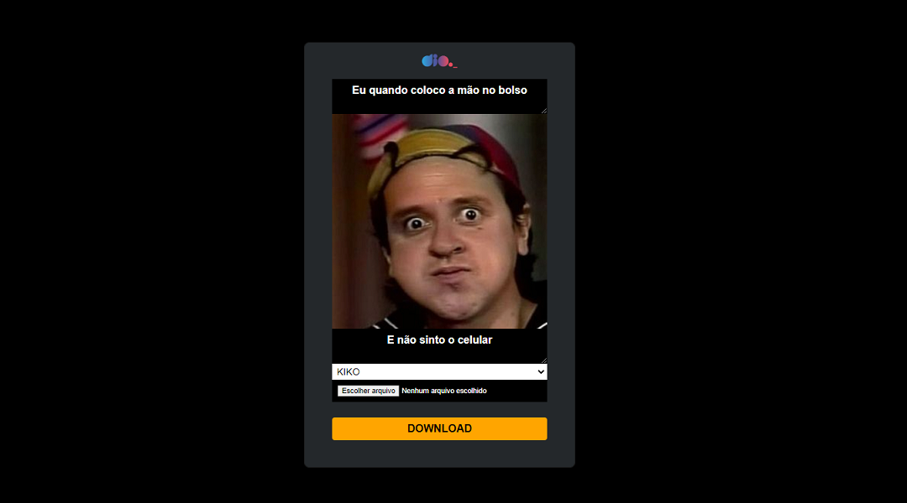

<h1 align="center">
  
</h1>

# Projeto máquina de memes

Este projeto é um gerador de memes

## Atividades

- Editar HTML dinamicamente
- Editar CSS dinamicamente
- Trabalhar com os eventos de listener
- Organizar o código de maneira funcional
- Utilizar biblioteca de terceiros (Html2Canvas)
- Manipular DOM
